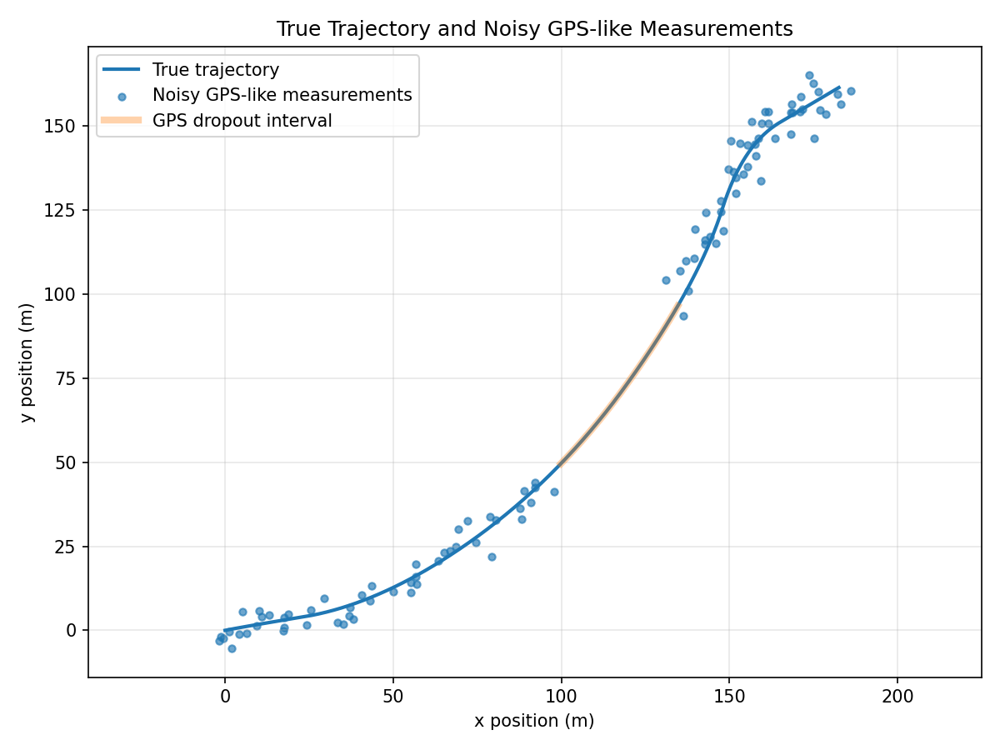
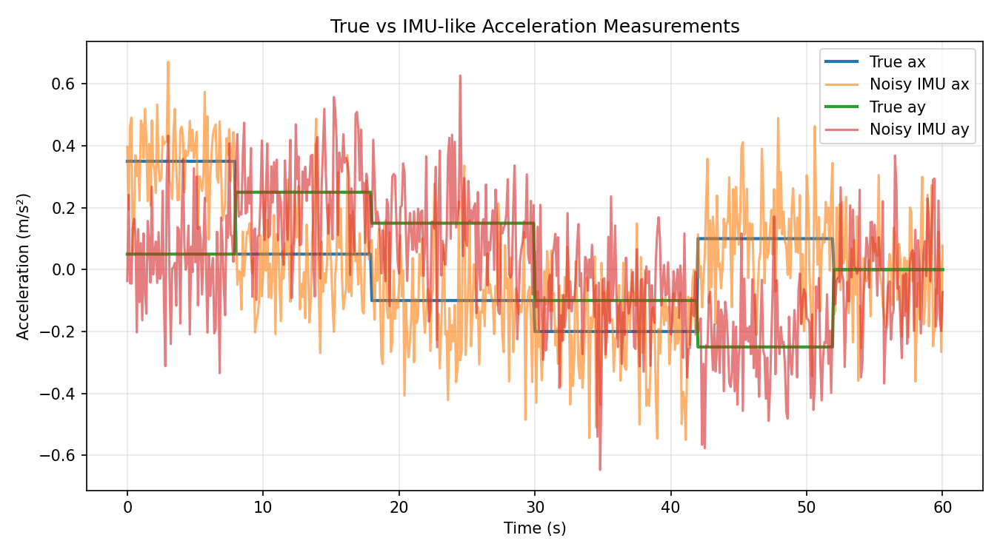
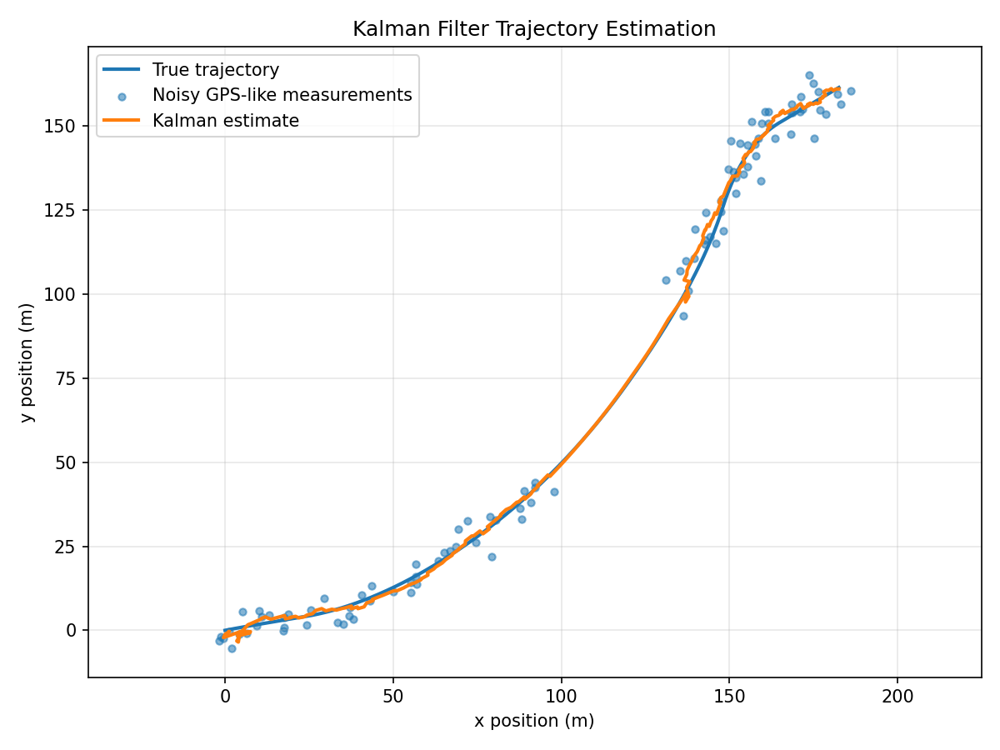
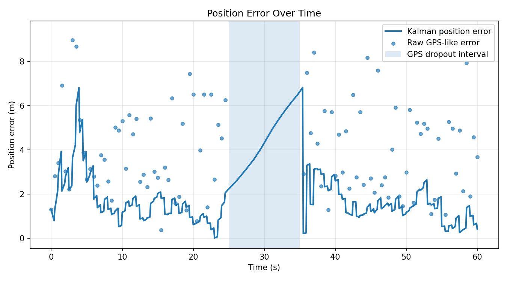
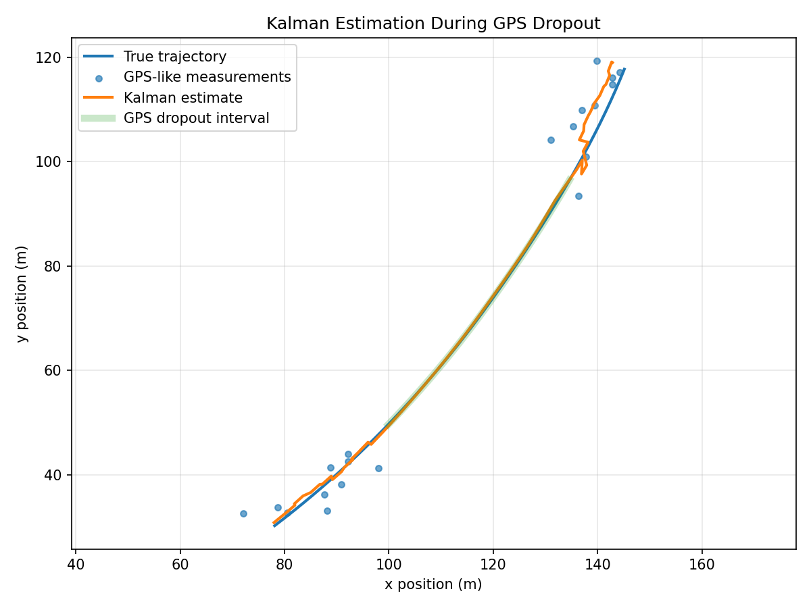
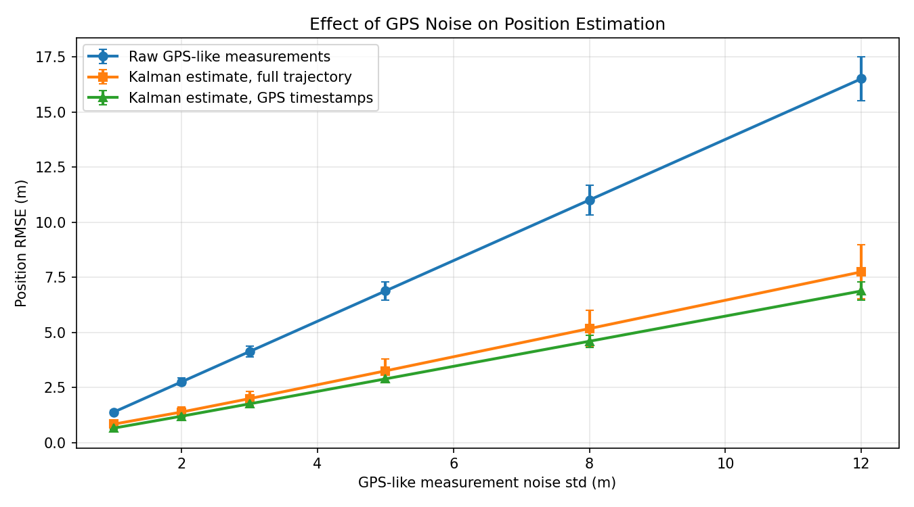
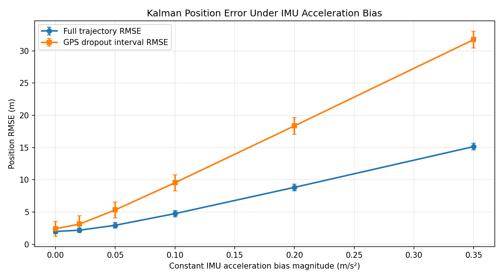
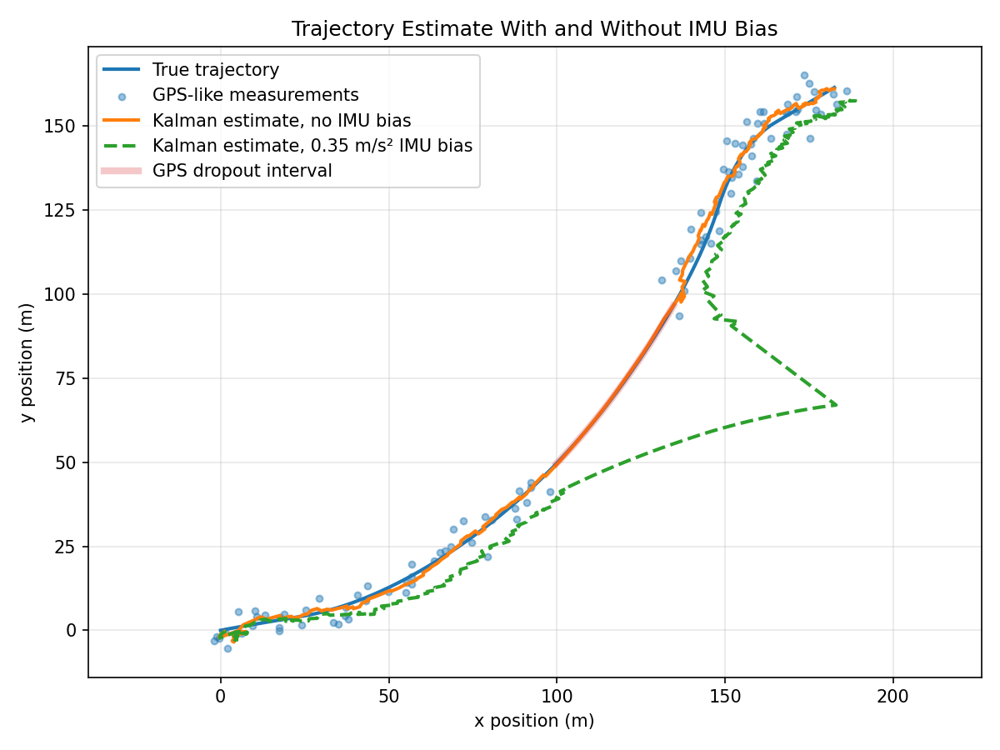
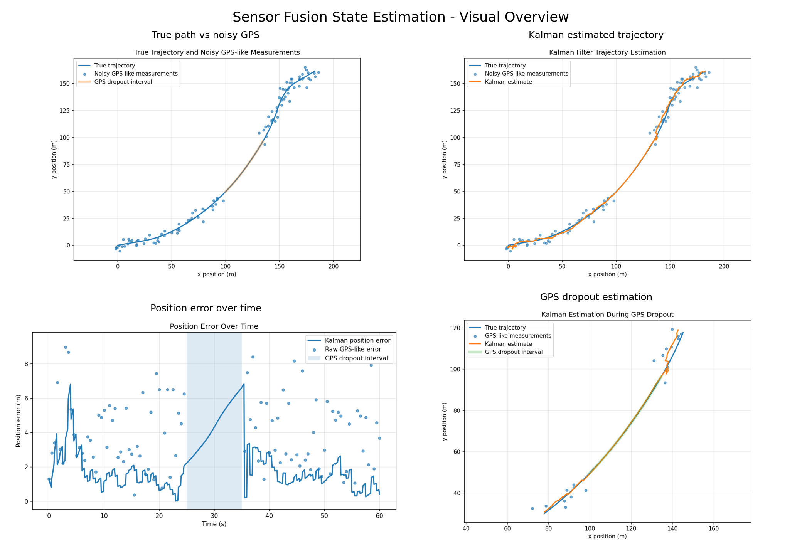
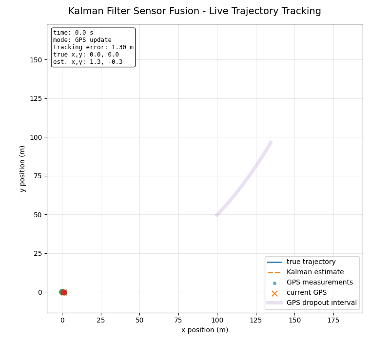

# Sensor Fusion State Estimation

I built this project to test a simple question: if position measurements become noisy or temporarily disappear, how much can a motion model and IMU-like acceleration help keep the estimated trajectory stable?

The setup is intentionally simulated. A 2D platform follows a scripted motion path, noisy GPS-like measurements provide intermittent position updates, and IMU-like acceleration is used in the Kalman Filter prediction step.

The most useful part of the project is not just the final trajectory plot. It is the comparison between normal GPS updates, a GPS dropout interval, and different GPS noise levels. That made the estimator's strengths and weaknesses much easier to see.

Main pieces:

- 2D motion simulation
- GPS-like noisy position measurements
- IMU-like acceleration inputs
- GPS dropout experiment
- linear Kalman Filter state estimation
- RMSE and error plots
- multi-noise-level comparison
- trajectory tracking animation

---

## What I built

The goal is to estimate the 2D position and velocity of a moving platform using a linear Kalman Filter.

The simulated platform follows a scripted 2D motion profile with acceleration, turning, and deceleration phases. I then generate noisy sensor measurements and compare the estimated trajectory against the true trajectory.

Workflow:

- simulated 2D trajectory
- noisy GPS-like position measurements
- IMU-like acceleration inputs
- GPS dropout interval
- Kalman Filter prediction/correction
- estimated trajectory
- RMSE and error analysis

One thing I had to tune carefully was the balance between trusting the motion model and trusting the GPS-like measurements. When the GPS noise is increased, the filter can still smooth the trajectory, but it cannot magically recover information that is not present in the measurements.

---

## Simulated Sensor Data

The simulation script generates a 2D trajectory and two types of sensor measurements.

### GPS-like Position Measurements

The GPS-like sensor provides noisy position measurements:

```text
gps_x_m
gps_y_m
```

GPS measurements are available at a lower rate than the simulation timestep. A GPS dropout interval is also simulated to represent temporary loss of position measurements.

### IMU-like Acceleration Measurements

The IMU-like sensor provides noisy acceleration measurements:

```text
imu_ax_mps2
imu_ay_mps2
```

These acceleration values are used as control inputs in the Kalman Filter prediction step.

---

## Generated Data

The simulation script creates:

```text
data/simulated/simulated_sensor_data.csv
```

The dataset includes:

- true 2D position
- true 2D velocity
- true 2D acceleration
- noisy IMU-like acceleration
- noisy GPS-like position measurements
- GPS availability flag

Main columns:

```text
time_s
true_x_m
true_y_m
true_vx_mps
true_vy_mps
true_ax_mps2
true_ay_mps2
imu_ax_mps2
imu_ay_mps2
gps_x_m
gps_y_m
gps_available
```

---

## Kalman Filter Model

The Kalman Filter estimates the state vector:

```text
x = [position_x, position_y, velocity_x, velocity_y]
```

The filter uses a constant-velocity motion model with acceleration input.

Prediction step:

```text
x_k = F x_{k-1} + B u_k
```

where:

```text
u_k = [acceleration_x, acceleration_y]
```

Correction step:

```text
z_k = H x_k
```

where the measurement is the GPS-like position:

```text
z_k = [gps_x, gps_y]
```

When GPS-like measurements are unavailable, such as during the dropout interval, the filter only performs prediction using the motion model and IMU-like acceleration input.

---

## Current Outputs

### True Trajectory and GPS-like Measurements



### True vs IMU-like Acceleration



### Kalman Filter Estimated Trajectory



### Position Error Over Time



### GPS Dropout Estimation



### GPS Noise-Level Comparison



### IMU Bias Sensitivity





---

## Results

The Kalman Filter improves position estimation compared with raw GPS-like measurements.

Current RMSE results:

| Method | Position RMSE |
|---|---:|
| Raw GPS-like measurements | 4.51 m |
| Kalman filter estimate over full trajectory | 2.61 m |
| Kalman estimate at GPS timestamps | 1.82 m |

The raw GPS-like RMSE is computed only when GPS-like measurements are available.

The full Kalman trajectory RMSE is computed over the entire trajectory, including the GPS dropout interval.

The result shows that the Kalman Filter produces a smoother and more accurate trajectory estimate than raw noisy GPS-like measurements.

During GPS dropout, the estimation error increases because the filter relies only on the motion model and IMU-like acceleration input. After GPS measurements return, the filter corrects the trajectory estimate.

Detailed RMSE output:

```text
results/rmse_comparison.csv
```

Estimated trajectory dataset:

```text
data/simulated/kalman_estimates.csv
```

---

## Noise-Level Comparison

To evaluate robustness under different sensor conditions, this project includes a GPS noise-level comparison experiment.

The experiment repeats the simulation and Kalman Filter estimation for several GPS-like measurement noise levels:

```text
1 m, 2 m, 3 m, 5 m, 8 m, 12 m
```

For each noise level, the experiment is repeated 5 times with different random seeds.

Generated outputs:

```text
results/noise_level_comparison.csv
results/noise_level_rmse_comparison.png
```

### Noise-Level RMSE Comparison


The results show that the Kalman Filter consistently reduces position RMSE compared with raw GPS-like measurements across all tested noise levels.

At high GPS noise levels, the gap between raw measurements and Kalman estimates becomes larger, showing the value of combining a motion model with noisy sensor data.

Example results:

| GPS Noise Std | Raw GPS RMSE | Kalman Full-Trajectory RMSE |
|---:|---:|---:|
| 1 m | 1.38 m | 0.83 m |
| 3 m | 4.13 m | 1.99 m |
| 8 m | 11.01 m | 5.17 m |
| 12 m | 16.51 m | 7.75 m |

## IMU Bias Sensitivity

I also added an IMU acceleration-bias sensitivity experiment. This tests what happens when the filter receives acceleration measurements with a small constant bias.

This matters because acceleration bias is dangerous during GPS dropout. When GPS-like measurements are available, the Kalman correction step can pull the estimate back toward the measured position. During dropout, the filter has to rely more heavily on the motion model and IMU-like acceleration input, so bias can accumulate quickly.

Generated outputs:

- `results/imu_bias_sensitivity.csv`
- `results/imu_bias_rmse_comparison.png`
- `results/imu_bias_trajectory_comparison.png`

Example results:

| IMU Bias Level | Full-Trajectory RMSE | GPS-Dropout RMSE | Final Error |
|---:|---:|---:|---:|
| 0.00 m/s² | 1.99 m | 2.42 m | 0.92 m |
| 0.10 m/s² | 4.76 m | 9.56 m | 1.41 m |
| 0.35 m/s² | 15.16 m | 31.75 m | 6.27 m |

The main takeaway is that the estimator is much more sensitive to IMU bias during the GPS dropout interval than during normal GPS-corrected operation.

---

## Repository Structure

```text
sensor-fusion-state-estimation/
├── data/
│   └── simulated/
│       ├── kalman_estimates.csv
│       └── simulated_sensor_data.csv
├── docs/
├── results/
│   ├── gps_dropout_estimation.png
│   ├── imu_bias_rmse_comparison.png
│   ├── imu_bias_sensitivity.csv
│   ├── imu_bias_trajectory_comparison.png
│   ├── kalman_estimated_trajectory.png
│   ├── noise_level_comparison.csv
│   ├── noise_level_rmse_comparison.png
│   ├── position_error_over_time.png
│   ├── rmse_comparison.csv
│   ├── true_vs_gps_measurements.png
│   └── true_vs_imu_acceleration.png
├── src/
│   ├── evaluate_imu_bias.py
│   ├── evaluate_noise_levels.py
│   ├── kalman_filter.py
│   └── simulate_motion.py
├── .gitignore
├── README.md
└── requirements.txt
```

---

## Main Files

- `src/simulate_motion.py`  
  Generates the true 2D trajectory, noisy GPS-like measurements, noisy IMU-like acceleration measurements, GPS dropout interval, and initial plots.

- `src/kalman_filter.py`  
  Implements a Kalman Filter for 2D position and velocity estimation using GPS-like position measurements and IMU-like acceleration inputs.

- `src/evaluate_noise_levels.py`  
  Runs a GPS noise-level comparison experiment and evaluates how raw GPS-like measurements and Kalman estimates behave under different measurement noise levels.

- `src/evaluate_imu_bias.py`  
  Runs an IMU bias sensitivity experiment and measures how constant acceleration bias affects full-trajectory RMSE, GPS-dropout RMSE, and final estimation error.

- `docs/math_model.md`  
  Explains the state vector, motion model, measurement model, Kalman Filter prediction/correction steps, and GPS dropout behavior.

- `docs/project_report.md`  
  Provides a project-level report covering the goal, sensor model, Kalman Filter design, experiments, results, limitations, and future work.

- `docs/results_interpretation.md`  
  Explains the RMSE results, GPS dropout behavior, noise-level comparison, project limitations, and relevance to robotics and navigation.

- `data/simulated/simulated_sensor_data.csv`  
  Simulated sensor dataset with true states and noisy sensor measurements.

- `data/simulated/kalman_estimates.csv`  
  Dataset containing true states, measurements, Kalman estimates, and position errors.

- `results/rmse_comparison.csv`  
  RMSE comparison between raw GPS-like measurements and Kalman Filter estimates.

- `results/noise_level_comparison.csv`  
  RMSE comparison across multiple GPS-like measurement noise levels.

- `results/noise_level_rmse_comparison.png`  
  Visualization of how position RMSE changes as GPS-like measurement noise increases.

---

## How to Run

Create and activate a virtual environment:

```bash
python3 -m venv venv
source venv/bin/activate
```

Install dependencies:

```bash
pip install -r requirements.txt
```

Generate simulated trajectory and sensor data:

```bash
python src/simulate_motion.py
```

Run Kalman Filter estimation:

```bash
python src/kalman_filter.py
```

Run GPS noise-level comparison:

```bash
python src/evaluate_noise_levels.py
python src/evaluate_imu_bias.py
```

---

## What the results show

The filter performs best when the simulated GPS-like measurements are noisy but still available. During the GPS dropout interval, the estimate depends more heavily on the motion model and acceleration input, so the position error grows more easily.

This is the main engineering takeaway: sensor fusion is not just about adding more sensors. It is about understanding what each sensor can and cannot correct.

---

## Limitations

Current limitations:

- the trajectory is simulated
- the GPS and IMU measurements are synthetic
- the model uses a linear Kalman Filter
- IMU bias is tested in a sensitivity experiment, but the filter does not yet estimate or compensate for bias
- orientation estimation is not included
- the system does not yet use real hardware sensor data

---

## Future Work

Planned extensions:

- add IMU bias estimation or bias-compensated filtering
- add longer GPS dropout experiments
- compare different Kalman Filter tuning parameters
- add Extended Kalman Filter for nonlinear motion
- connect this simulation project to a real ESP32 + IMU attitude estimation project
- use real sensor logs in a future hardware-based extension

---

## Summary

This project demonstrates 2D sensor fusion and state estimation for an autonomous motion tracking scenario.

It simulates a moving platform, generates noisy GPS-like and IMU-like measurements, applies a Kalman Filter, and evaluates the estimated trajectory using RMSE and error plots.

The project is a small bridge between dynamic systems, sensing, filtering, and robotics-style motion tracking.

## Visual overview

The figure below summarizes the main sensor fusion outputs: noisy GPS measurements, Kalman estimated trajectory, position error over time, and GPS dropout behavior.



### Live Trajectory Tracking Animation

The animation below shows the Kalman Filter tracking the moving platform over time. It visualizes the true trajectory, noisy GPS-like measurements, and the estimated trajectory during normal updates and GPS dropout.


